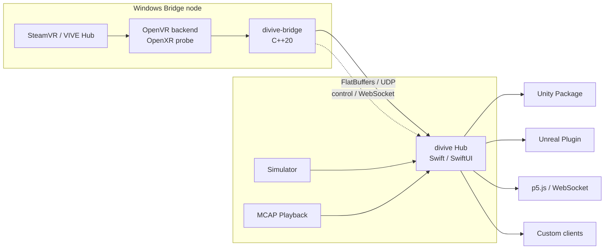

# divive

VIVE Trackerの6DoF姿勢を、ヘッドセットなしのWindows取得機からMacへ低遅延で配信し、Unity、Unreal Engine、p5.js、独自コンテンツから共通APIで利用するためのトラッキング基盤です。

> [!IMPORTANT]
> 現在は設計・実機検証フェーズです。Tracker 3.0とVIVE Ultimate Trackerのヘッドセットなし運用をGate 0で検証するまで、取得backendの成立性を確定事項として扱いません。

## 目標

- コンテンツからSteamVR/VIVE固有処理を排除する
- WindowsからMacへ最新姿勢を優先して配信する
- 実機がなくてもSimulatorとPlaybackでMac単体開発を可能にする
- シリアル番号と論理ロールの対応を再接続後も維持する
- 3〜5台のMVPから、複数Bridgeを使って約16台まで拡張できるようにする
- パケット欠落、遅延、ジッター、追跡喪失を観測・再現できるようにする

## 非目標

- SteamVRやVIVE Hubを置き換えること
- UDPで過去の姿勢フレームを再送すること
- インターネット越しの一般公開サービス
- MVPでTracker 3.0とUltimate Trackerの全機能差を完全に吸収すること
- 単一Windows PCで16台のUltimate Trackerを扱えると仮定すること

## 構成

Bridgeは複数台接続できます。各Bridgeの追跡空間は独立しているため、Hubで共通Stage Spaceへキャリブレーションします。

## 採用方針

| 領域 | 技術 |
| --- | --- |
| Windows Bridge | C++20、MSVC、CMake、vcpkg |
| 取得backend | OpenVRをMVP本命、OpenXRを実機検証 |
| Mac Hub | Swift、SwiftUI、RealityKit、SwiftNIO |
| 実時間データ | FlatBuffers over UDP |
| 制御 | HTTP / WebSocket + JSON |
| 録画 | MCAP + FlatBuffers payload |
| Unity | C# Unity Package |
| Unreal Engine | C++ Plugin + Blueprint API |
| Web | TypeScript |

この選択の根拠は[Architecture Decision Records](docs/adr/README.md)に記録します。

## ロードマップ

| Milestone | 到達点 | 状態 |
| --- | --- | --- |
| M0: Feasibility | Tracker 3.0 / Ultimateのheadless取得経路を確定 | Planned |
| M1: Vertical Slice | 実機1台をWindowsからMac CLIへUDP配信 | Planned |
| M2: Developer MVP | Mac Hub GUI、Simulator、Unity、録画・再生 | Planned |
| M3: Content SDKs | Unreal、p5.js、制御API、障害注入 | Planned |
| M4: Production Readiness | 複数Bridge、長時間運用、認証、配布 | Planned |

詳細、停止条件、完了基準は[Roadmap](docs/roadmap.md)と[Implementation Plan](docs/implementation-plan.md)を参照してください。

## ドキュメント

| 文書 | 内容 |
| --- | --- |
| [ドキュメント一覧](docs/README.md) | 文書の入口と更新ルール |
| [要求仕様](docs/requirements.md) | 要求、性能目標、前提、traceability |
| [アーキテクチャ](docs/architecture.md) | コンポーネント、データフロー、障害設計 |
| [実装計画](docs/implementation-plan.md) | 実装順、依存関係、完了基準 |
| [ロードマップ](docs/roadmap.md) | Milestoneとスコープ |
| [実機検証計画](docs/hardware-validation.md) | 実機検証項目と判定基準 |
| [通信プロトコル](docs/protocol.md) | 通信、時刻、順序、データモデル |
| [キャリブレーション](docs/calibration.md) | 座標空間と変換プロファイル |
| [開発ガイド](docs/development.md) | 開発環境、CI、テスト、リリース |
| [コントリビューションガイド](CONTRIBUTING.md) | Issue、PR、設計変更の進め方 |

## 最初に行うこと

実装開始前に、Windows実機で[Hardware Validation](docs/hardware-validation.md)のGate 0を実行します。特に次の結果が必要です。

1. Tracker 3.0をヘッドセットなしで安定して列挙・取得できる
2. Ultimate TrackerがVIVE Hub経由でOpenVRまたはOpenXRへ公開される
3. シリアル、姿勢、速度、追跡状態、電池情報の可用性が分かる
4. SteamVR/VIVE Hub再起動後のID安定性が分かる
5. 3〜5台同時取得時の更新頻度と欠落特性が分かる

検証結果が揃うまでは、M1以降のbackend実装を固定しません。

M0用の[OpenVR実機検証probe](bridge/probes/openvr/README.md)は実装済みです。Windows x86-64 artifactをbuildし、[実機検証手順](hardware-tests/README.md)に従ってH0/H1から実行します。

M0と並行可能な[wire protocol v1](protocol/README.md)は実装済みです。72-byte
envelope、FlatBuffers schema、C++ codec、golden packetをprotocol conformance
testで固定しています。

[Mac Hub headless receiver](hub/README.md)は、同じgolden packetのSwift decode、
sequence/loss判定、SwiftNIO UDP受信、CLI診断まで実装済みです。Windows Bridgeとの
実機vertical slice、Hub state、GUI、content配信はまだ含みません。

## ライセンス

未決定です。外部公開や第三者への配布前に決定します。
