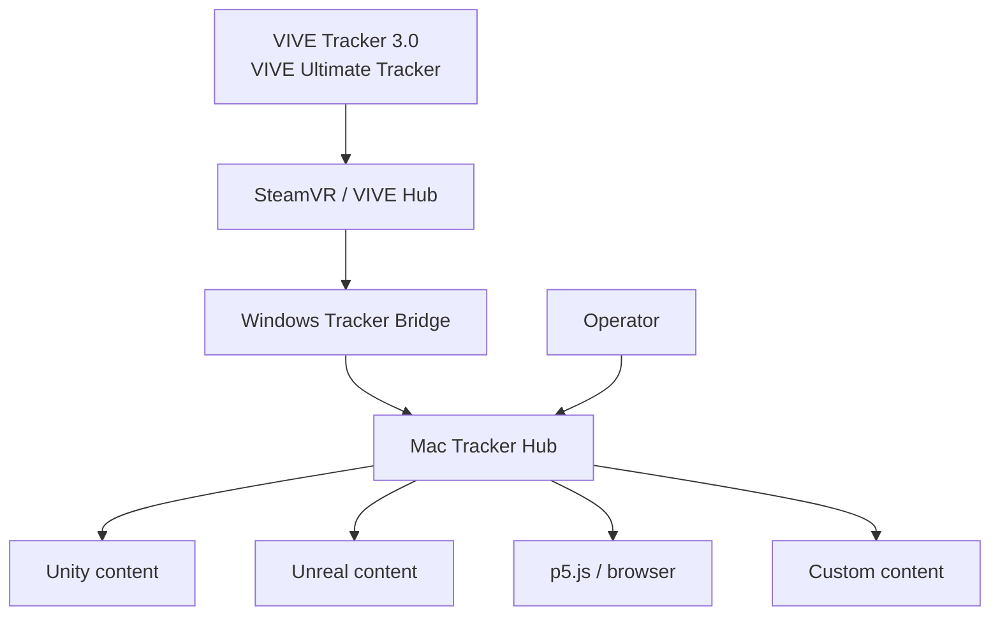
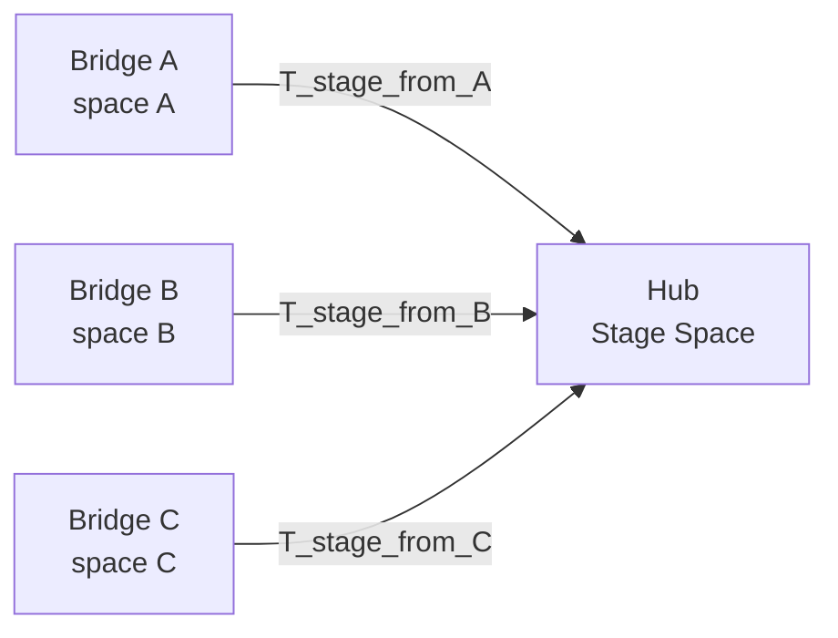
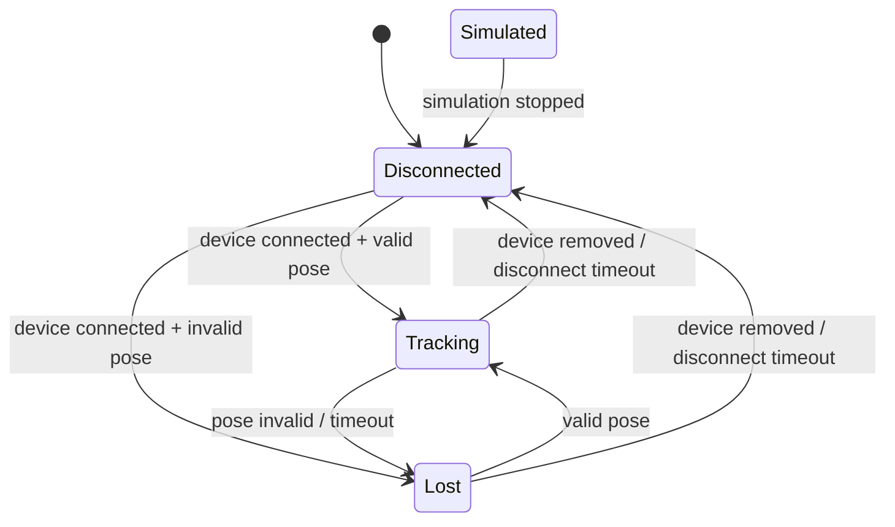

# アーキテクチャ

## 設計上の優先事項

優先順位は次の通りです。

1. ハードウェア/runtimeとの互換性
2. 古い姿勢を表示しないこと
3. 障害を観測・再現できること
4. 実機なしでコンテンツ開発できること
5. 複数Tracker、複数Bridgeへの拡張
6. 単一言語やコード共有の最大化

低遅延は重要ですが、16台×120Hz程度のデータ量そのものは小さいため、CPU性能よりqueue、時刻、runtime互換性を重視します。

## システム全体像



### 信頼境界

- Tracker runtimeとBridgeは同じWindowsユーザーセッション
- BridgeとHubは同一LAN
- Hubのcontent APIは既定でlocalhostのみ
- LAN公開時はtrusted networkだけを前提にせず認証する
- mDNSは発見にのみ使い、相手の正当性を保証しない

## コンポーネント

### Windows Tracker Bridge

責務:

- runtime接続
- device inventory
- pose/status acquisition
- canonical modelへの正規化
- binary frame生成
- Mac Hubへの送信
- runtime、network、rateのmetrics

責務外:

- content別座標変換
- 補間
- 録画
- 3D GUI
- role編集

BridgeはWindows Serviceではなくログインユーザーのプロセスとして動かします。SteamVR/VIVE Hubと同じ対話セッションに置き、Task Schedulerで自動起動・再起動します。

### Mac Tracker Hub

責務:

- 1台以上のBridgeから受信
- schema、sequence、timestamp検証
- clock mapping
- latest state管理
- tracking spaceとcalibration
- content subscription
- Simulator、Recorder、Playback
- GUIとcontrol API
- metricsとdiagnostics

### Content clients

責務:

- Hub接続
- Tracker IDまたはrole選択
- engine座標系への最終変換
- 描画時刻に対する補間
- tracking stateに応じたcontent挙動

SDKはSteamVR/VIVE Hubを認識しません。

## 複数Bridgeモデル

単一Bridgeを前提にしません。



各Bridgeは次を持ちます。

- `bridge_id`: Bridgeインストールを識別するUUID
- `tracking_space_id`: runtimeの追跡空間を識別するUUID
- `space_epoch`: room setup、map再生成、runtime resetで増える世代
- `source_type`: OpenVR、OpenXR、simulator、playback

異なる`tracking_space_id`の姿勢を、対応するcalibrationなしで同じStage Spaceへ公開してはいけません。

## データパイプライン

```text
capture backend
  → source snapshot
  → canonical normalization
  → frame batching
  → UDP
  → validation
  → loss/order accounting
  → latest raw state
  → calibration
  → latest stage state
  ├─ recorder
  ├─ local native distributors
  ├─ WebSocket distributor
  └─ GUI snapshot
```

### 最新値優先規則

- pose経路に無制限queueを置かない
- consumerが遅い場合、未送信の古いposeを新しいposeで上書きする
- status、configuration、recording commandは失ってはいけないため、poseとは別経路にする
- Recorderだけは時系列を保存するが、disk writerの遅延がingestをブロックしないようbounded bufferとdrop metricsを持つ

### スレッド構成

Windows:

- runtime capture thread
- network send threadまたはnon-blocking event loop
- control/logging worker

Mac:

- SwiftNIO event loop
- state/calibration executor
- recorder I/O worker
- UI main actor

network callback内で圧縮、disk flush、3D描画、長いJSON生成を行いません。

## 入力sourceの抽象化

Hub入力は実機に依存しません。

```swift
protocol FrameSource {
    var sourceID: UUID { get }
    func start(_ sink: FrameSink) async throws
    func stop() async
}
```

想定実装:

- `NetworkFrameSource`
- `SimulatorFrameSource`
- `PlaybackFrameSource`

取得元を切り替えても、calibration、distribution、SDK APIは変えません。

## 状態遷移

Trackerの状態は少なくとも次を区別します。



- `tracking`: 接続済みでvalid pose
- `lost`: 接続済みだがvalid poseがない
- `disconnected`: deviceまたはBridgeが見えない
- `simulated`: Simulatorが生成

ネットワーク欠落と光学的なtracking lostを混同しません。原因は追加のreason fieldで表現します。

## 障害時の動作

| Failure | Expected behavior |
| --- | --- |
| UDP packet loss | 次の新しいframeを採用。再送待ちしない |
| Out-of-order | sequenceが古ければposeへ反映しない。metricsには計上 |
| Bridge disconnect | 対象BridgeのTrackerだけをstale/lost/disconnectedへ遷移 |
| Runtime restart | backend再接続。serialからroleを復元 |
| Hub recorder遅延 | pose配信を継続し、record dropを通知 |
| Slow WebSocket client | client単位でlatest frameへcoalesce |
| Calibration mismatch | content配信を停止またはuncalibratedとして明示 |
| Simulator failure injection | 実機と同じmetrics/state pathを通す |

## 観測性

最低限のmetrics:

- capture rate
- send/receive rate
- packet、frame、tracker record count
- loss、duplicate、out-of-order
- receive age、inter-arrival jitter
- capture loop overrun
- active/lost/disconnected trackers
- Bridge reconnect count
- recorder queue depth/drop
- per-client delivery rate
- calibration version/space epoch

one-way latencyはclock syncなしでは正確に測れません。M1ではreceive processing timeとinter-arrivalを測り、M4でclock offset推定を追加します。

## セキュリティ

MVP:

- private LAN
- Hub content APIはlocalhost bind
- explicit Bridge address
- secretをログへ出さない

Production:

- control channel token
- Bridge allowlist
- UDP packetにtruncated HMAC
- replay防止用session IDとsequence
- token rotation
- TLSまたはネットワーク層の保護

tokenだけで暗号化はされません。信頼できないLANではTLSまたはVPN/VLANを併用します。

## 配布と実行

### Windows

- x86-64 release artifact
- config、Bridge ID、log directory
- OpenVR runtime DLL
- Task Scheduler logon trigger
- runtimeより後に接続し、未起動時はbackoff

### macOS

- signed/notarized app bundle
- role/profile/recordingsをApplication Supportへ保存
- localhost portsは競合検出
- first-runでnetwork permissionと保存先を案内

## 制約と未解決リスク

- SteamVRのヘッドセットなし運用が将来も保証されるとは限らない
- Ultimate TrackerのPC利用はVIVE Hubとfirmwareへ依存する
- Ultimateは公式情報上、1台のPCまたはdongleあたり最大5台
- OpenXR tracker extensionは未批准
- 複数tracking spaceは別途較正が必要
- Wi‑FiとTracker無線は同じ2.4GHz周辺の干渉を受け得る

これらは[Hardware Validation](hardware-validation.md)で継続的に確認します。
