# キャリブレーションと座標空間

## 原則

- 追跡runtimeの座標を直接contentへ露出しない
- rigid calibrationとpresentation scaleを分ける
- 変換方向を名前で明示する
- profileとtracking spaceをversion管理する
- SDKごとの座標変換は決定的で、conformance testを持つ

## 座標空間

```mermaid
flowchart LR
    native["Backend Native Space"]
    tracker["Canonical Tracker Space"]
    stage["Stage Space"]
    content["Content Profile Space"]
    engine["Engine Space"]

    native -- "C_tracker_from_native" --> tracker
    tracker -- "T_stage_from_tracker" --> stage
    stage -- "P_content_from_stage" --> content
    content -- "E_engine_from_content" --> engine
```



### Backend Native Space

OpenVR/OpenXRが返す座標。backend外へそのまま出しません。

### Canonical Tracker Space

- right-handed
- metre
- +X right
- +Y up
- -Z forward
- quaternion `(x, y, z, w)`

Bridgeがnative spaceから正規化します。

### Stage Space

複数Bridgeと実空間を統合する共通空間です。各tracking spaceに対して剛体変換`T_stage_from_tracker`を持ちます。

### Content Profile Space

コンテンツ固有の原点、向き、任意scaleを表します。`unity-installation`、`ue-stage`、`p5-wall`などです。

### Engine Space

Unity、Unreal、p5.js側の規約です。SDKが変換します。

## 変換の合成

column vector表記を文書上の基準にします。

```text
p_stage   = T_stage_from_tracker * p_tracker
p_content = P_content_from_stage * p_stage
p_engine  = E_engine_from_content * p_content
```

実装言語やmath libraryがrow vectorを使う場合も、公開命名とテスト結果をこの定義に合わせます。

姿勢:

```text
q_stage = q_stage_from_tracker ⊗ q_tracker
```

positionとrotationで別の変換順序を使わないよう、rigid transform型でまとめます。

## 剛体較正とscale

Tracker SpaceからStage Spaceへの変換はSE(3)のrigid transformです。

- translation
- rotation
- scale = 1

物理空間の計測精度を損なわないため、scaleはここへ含めません。展示表現の拡大縮小が必要な場合だけ、Content Profileの`P_content_from_stage`へuniform scaleとして持たせます。

non-uniform scaleはrotationや速度の意味を壊すため、MVPでは非対応です。

## キャリブレーション方法

### MVP: origin and forward

1. 基準Trackerを原点へ置く
2. 基準方向を向ける
3. translationとyawを決める
4. up axisを固定する
5. known pointで誤差を確認する

床面を使う場合は高さoffsetを別途入力できます。

### Later: point-set registration

3点以上の対応点からrigid transformを推定します。

- 対応点の幾何が退化していないこと
- SVD/Kabsch等でrotation/translationを推定
- RMS/max residualを表示
- 外れ値除外は自動で隠さず、採否をoperatorへ示す

## 複数Bridgeのキャリブレーション

各Bridgeのtracking spaceごとにprofile entryを持ちます。

```json
{
  "profileId": "studio-a",
  "revision": 4,
  "spaces": {
    "space-a": {
      "epoch": 2,
      "translation": [0.0, 0.0, 0.0],
      "rotation": [0.0, 0.0, 0.0, 1.0],
      "rmsErrorM": 0.003
    }
  }
}
```

`space_epoch`が変わった場合、過去の較正を自動適用しません。operatorの確認または再較正を要求します。

## Profile metadata

- profile ID
- human-readable name
- revision
- created/updated time
- source tracking space IDとepoch
- transform
- optional content scale
- method
- sample count
- RMS/max residual
- operator note
- application version

role mappingはcalibration profileから分離します。同じ空間較正を使いながら、Trackerの役割だけ変更できるためです。

## Engine座標への変換

正確な変換は実装時にgolden vectorsで固定します。

### Unity

UnityのTransformへ渡す直前にhandednessとforward軸を変換します。positionだけでなくquaternion、linear/angular velocityも同じ基底変換を適用します。

### Unreal Engine

Unrealの座標単位へmetreから変換し、handednessと軸規約を変換します。positionの100倍だけで済ませず、rotationとangular velocityを検証します。

### p5.js

SDKはcanonical 3D値をそのまま提供します。canvas、WebGL camera、画面pixelへの投影はcontent側の責務です。

## 適合性テスト

全SDKで次のgolden casesを共有します。

- identity
- +X / +Y / -Z translation
- X/Y/Z軸の90度回転
- rotation + translation
- angular velocity
- profile scale
- two-Bridge composition
- quaternion sign equivalence

quaternion `q`と`-q`は同じrotationなので、成分の単純一致ではなく回転として比較します。

## 無効なキャリブレーションの扱い

- 未較正spaceは`uncalibrated`として表示する
- production profileでは未較正Trackerをcontentへ黙って混ぜない
- preview modeでは生のTracker Spaceを明示表示してよい
- profile load失敗時にidentity transformへ黙ってfallbackしない
- revision mismatchをmetricsとAPIへ出す
