# キャリブレーションと座標空間

## 原則

- 追跡runtimeの座標を直接contentへ露出しない
- rigid calibrationとpresentation scaleを分ける
- 変換方向を名前で明示する
- profileとtracking spaceをversion管理する
- SDKごとの座標変換は決定的で、conformance testを持つ

## 座標空間

```mermaid
flowchart LR
    native["Backend Native Space"]
    tracker["Canonical Tracker Space"]
    stage["Stage Space"]
    content["Content Profile Space"]
    engine["Engine Space"]

    native -- "C_tracker_from_native" --> tracker
    tracker -- "T_stage_from_tracker" --> stage
    stage -- "P_content_from_stage" --> content
    content -- "E_engine_from_content" --> engine
```



### Backend Native Space

OpenVR/OpenXRが返す座標。backend外へそのまま出しません。

### Canonical Tracker Space

- right-handed
- metre
- +X right
- +Y up
- -Z forward
- quaternion `(x, y, z, w)`

Bridgeがnative spaceから正規化します。

### Stage Space

複数Bridgeと実空間を統合する共通空間です。各tracking spaceに対して剛体変換`T_stage_from_tracker`を持ちます。

### Content Profile Space

コンテンツ固有の原点、向き、任意scaleを表します。`unity-installation`、`ue-stage`、`p5-wall`などです。

### Engine Space

Unity、Unreal、p5.js側の規約です。SDKが変換します。

## 変換の合成

column vector表記を文書上の基準にします。

```text
p_stage   = T_stage_from_tracker * p_tracker
p_content = P_content_from_stage * p_stage
p_engine  = E_engine_from_content * p_content
```

実装言語やmath libraryがrow vectorを使う場合も、公開命名とテスト結果をこの定義に合わせます。

姿勢:

```text
q_stage = q_stage_from_tracker ⊗ q_tracker
```

positionとrotationで別の変換順序を使わないよう、rigid transform型でまとめます。

## 剛体較正とscale

Tracker SpaceからStage Spaceへの変換はSE(3)のrigid transformです。

- translation
- rotation
- scale = 1

物理空間の計測精度を損なわないため、scaleはここへ含めません。展示表現の拡大縮小が必要な場合だけ、Content Profileの`P_content_from_stage`へuniform scaleとして持たせます。

non-uniform scaleはrotationや速度の意味を壊すため、MVPでは非対応です。

## キャリブレーション方法

### MVP: origin and forward

1. 基準Trackerを原点へ置く
2. 基準方向を向ける
3. translationとyawを決める
4. up axisを固定する
5. known pointで誤差を確認する

床面を使う場合は高さoffsetを別途入力できます。

`OriginAndForwardEstimator`が実装済みです。up軸は`+Y`に固定し、前方サンプルの
高さ差をyawへ持ち込みません。前方方向の水平距離が0.1m未満の場合は、わずかなjitterで
yawが大きく振れるため`degenerateForwardDirection`を返して較正を拒否します。

静止Trackerの複数frameは`CalibrationSample.fromStationaryFrames`で成分ごとの
中央値へまとめます。遮蔽復帰やjitterで1 frameだけ大きく外れることがあり、平均では
原点がその1点に引きずられるためです。

known pointは`CalibrationCheckPoint`として与え、RMSとmax residualを
`SpaceCalibration`のmetadataへ記録します。

### Later: point-set registration

3点以上の対応点からrigid transformを推定します。

- 対応点の幾何が退化していないこと
- rotation/translationを推定
- RMS/max residualを表示
- 外れ値除外は自動で隠さず、採否をoperatorへ示す

`PointSetRegistration`が実装済みです。推定にはHornのquaternion法を使います。対応点から
作った4x4対称行列の最大固有ベクトルがrotationのquaternionになり、固有値分解はJacobi法で
解きます。quaternionを直接得るため、SVD/Kabschで必要な反射補正が不要になり、鏡像解を
構造的に作れません。

退化は重心まわりの共分散行列の固有値で判定します。最大固有値の平方根が0.05m未満なら
`correspondencesTooClose`、第2固有値との比が`1e-4`未満なら`collinearCorrespondences`を
返します。同一平面上の対応点は退化ではないため受け入れます。

外れ値は自動除外しません。黙って点を捨てると、較正が良く見えたまま実空間とずれるため、
residualを返して採否をoperatorへ委ねます。

## 複数Bridgeのキャリブレーション

各Bridgeのtracking spaceごとにprofile entryを持ちます。keyは`tracking_space_id`の
canonical UUID文字列です。

```json
{
  "formatVersion": 1,
  "profileId": "studio-a",
  "name": "Studio A",
  "revision": 4,
  "createdAt": "2026-07-28T00:00:00Z",
  "updatedAt": "2026-07-28T00:12:00Z",
  "applicationVersion": "0.1.0",
  "spaces": {
    "00010203-0405-0607-0809-0a0b0c0d0e0f": {
      "spaceEpoch": 2,
      "translation": [0.0, 0.0, 0.0],
      "rotation": [0.0, 0.0, 0.0, 1.0],
      "method": "origin_and_forward",
      "sampleCount": 12,
      "rmsErrorM": 0.003,
      "maxResidualM": 0.006,
      "operatorNote": "床面基準",
      "updatedAt": "2026-07-28T00:12:00Z"
    }
  }
}
```

`space_epoch`が変わった場合、過去の較正を自動適用しません。operatorの確認または再較正を要求します。

## Profile metadata

- format version
- profile ID
- human-readable name
- revision
- created/updated time
- source tracking space IDとepoch
- transform
- optional content scale
- method
- sample count
- RMS/max residual
- operator note
- application version

role mappingはcalibration profileから分離します。同じ空間較正を使いながら、Trackerの役割だけ変更できるためです。

## Hubの実装状況

Swift側の`HubCalibration`が、rigid transform、profile、gate、永続化、golden testを
提供します。

| 型 | 責務 |
| --- | --- |
| `RigidTransform` | SE(3)変換、合成、逆変換、正規化検査 |
| `CalibrationProfile` | format version、revision、space単位の較正metadata |
| `CalibrationResolver` | `tracking_space_id`と`space_epoch`の引き当てとStage変換 |
| `CalibrationStore` | JSONへのatomic保存と読み込み |
| `OriginAndForwardEstimator` | origin and forward手順の推定、退化検出、residual評価 |
| `CalibrationResolver.project(_:)` | 評価済みHub snapshotへの較正適用とTracker単位の配信区分 |
| `PointSetRegistration` | 3点以上の対応点からのrigid推定、退化検出、residual |

`CalibrationResolver`は較正済みspaceを`stage`、未較正を`uncalibrated`、epoch不一致を
`epochMismatch`として返します。production modeでは後2者を配信せず、preview modeでは
生Tracker Spaceであることを明示したうえで変換せずに通します。

`project(_:)`はTrackerごとに`stage` / `rawTrackerSpace` / `blocked`を付け、変換前の
Tracker Space poseとliveness評価を残したまま返します。未較正のTrackerをsnapshotから
取り除かないのは、「表示しない」と「較正済みとして表示する」のどちらでもoperatorが
状況を把握できなくなるためです。

Mac GUIからはorigin and forward手順で較正でき、profileは
`~/Library/Application Support/divive/calibration.json`へ保存されます。詳細は
[Mac Hub GUI](../hub/GUI.md)を参照してください。

Content Profile Spaceのpresentation scale、role mappingの永続化、GUIからの
point-set registration対応点取得はまだ実装していません。


## Engine座標への変換

正確な変換は実装時にgolden vectorsで固定します。

### Unity

UnityのTransformへ渡す直前にhandednessとforward軸を変換します。positionだけでなくquaternion、linear/angular velocityも同じ基底変換を適用します。

### Unreal Engine

Unrealの座標単位へmetreから変換し、handednessと軸規約を変換します。positionの100倍だけで済ませず、rotationとangular velocityを検証します。

### p5.js

SDKはcanonical 3D値をそのまま提供します。canvas、WebGL camera、画面pixelへの投影はcontent側の責務です。

## 適合性テスト

全SDKで次のgolden casesを共有します。fixtureは
[calibration/golden/transform_v1.cases.json](../calibration/golden/transform_v1.cases.json)
に置き、追加手順は[Calibration golden fixture](../calibration/README.md)を参照します。

| case | fixtureの名前 |
| --- | --- |
| identity | `identity` |
| +X / +Y / -Z translation | `translation_only` |
| X/Y/Z軸の90度回転 | `pitch_90_about_right` / `yaw_90_about_up` / `roll_90_about_forward_axis` |
| rotation + translation | `yaw_90_then_translation` |
| angular velocity | `velocity_ignores_large_translation` |
| two-Bridge composition | `two_space_composition` |
| quaternion sign equivalence | `quaternion_sign_equivalence` |

profile scaleはContent Profile Spaceの責務のため、rigid transformのfixtureへ含めず、
presentation scaleを実装する段階で別caseとして追加します。

quaternion `q`と`-q`は同じrotationなので、成分の単純一致ではなく回転として比較します。

## 無効なキャリブレーションの扱い

- 未較正spaceは`uncalibrated`として表示する
- production profileでは未較正Trackerをcontentへ黙って混ぜない
- preview modeでは生のTracker Spaceを明示表示してよい
- profile load失敗時にidentity transformへ黙ってfallbackしない
- revision mismatchをmetricsとAPIへ出す
