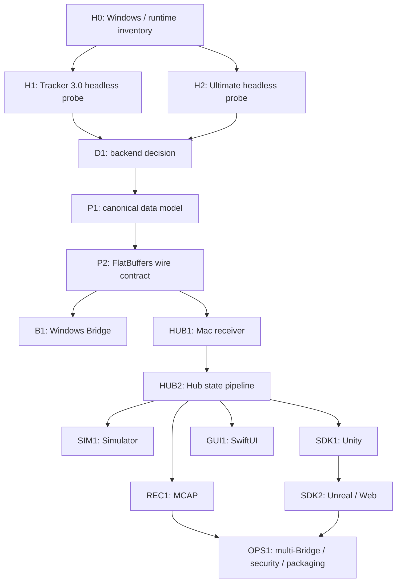

# 実装計画

## 成功条件

MVPの成功は「すべてのSDKが揃うこと」ではなく、次のvertical sliceが再現可能になることです。

1. WindowsがTracker姿勢を取得する
2. Mac Hubが最新姿勢を受信する
3. キャリブレーション済み姿勢をUnityが利用する
4. 同じ入力をSimulatorとPlaybackで置き換えられる
5. 欠落、遅延、追跡喪失を観測できる

## 現在の実装状況

- [x] A1 OpenVR probeのsource、JSONL、共通unit test
- [x] macOSでOpenVR非依存coreをbuild/test
- [x] Windows x64 build用CIとartifact作成
- [ ] Windows実機でH0/H1を実行
- [ ] Ultimate実機でH2を実行
- [ ] 実機結果に基づくA3 backend decision
- [x] B0 canonical pose modelをFlatBuffers schemaとして固定
- [x] B1 72-byte envelope、64-bit sequence、golden packetを実装
- [x] C++ encoder/decoderとmacOS conformance test
- [x] Swift receiverで同じgolden packetを検証
- [x] SwiftNIO UDP receiverとlocalhost loopback test
- [x] C++ UDP publisher、1,200-byte batch分割、simulated sender
- [x] C++ sender → Swift receiverのlocalhost複数batch結合
- [x] HubCoreの複数batch再構成とlatest Tracker state
- [x] receive ageに基づくlost / disconnected評価
- [ ] Windows sender → Mac CLIの有線LAN結合
- [ ] Windows BridgeからMac CLIへの実機UDP vertical slice

sourceが完成してもM0は完了ではありません。Windows実機の証跡とGate判定が必要です。

## 依存関係



ハードウェアprobeの完了前に、本番backendへ大きな投資をしません。protocolとSimulatorは並行着手できますが、取得API固有のfieldをcanonical modelへ漏らさないようにします。

## 作業領域A: Hardwareと取得

### A0. 環境inventory

- Windows、CPU、USB controller、NIC
- SteamVR、VIVE Hub、OpenVR/OpenXR runtime
- Tracker型番、serial、firmware
- dongle、base station、無線構成

**Deliverable:** `hardware-tests/runs/<date>-<machine>/environment.md`

### A1. OpenVR probe

最小console programで以下だけを出力します。

- device index、class
- serial、manufacturer、model
- valid、connected、tracking result
- matrix、linear/angular velocity
- battery、charging
- poll intervalと値の変化

**Deliverable:** source、build手順、JSONLログ、結論。

### A2. OpenXR probe

`XR_HTCX_vive_tracker_interaction`の有無、tracker path列挙、action spaceからのpose取得を確認します。OpenXRを採用しない場合も、採用しない根拠を残します。

### A3. backend decision

判定は次の順です。

1. OpenVRで両Trackerを取得できるならOpenVR一本
2. UltimateのみOpenXRが必要なら2 backend
3. Ultimateがheadless非対応ならMVP対象外または前提変更
4. 非公開・非保証APIやBluetooth直結はproduction backendにしない

## 作業領域B: Protocol

### B0. Canonical model

実装言語に依存しない型を先に確定します。

- namespaced permanent ID
- logical role
- canonical pose
- velocity
- tracking state
- capture time、send time、sequence
- bridge、tracking space、calibration version

### B1. Wire contract

- FlatBuffers schema
- 最大1,200 byteのUDP datagram
- batch分割
- major/minor version
- golden packet
- 不明fieldを無視するforward compatibility

### B2. Clock model

送信元と受信先のmonotonic clockを直接比較しません。control channelでRTTとoffsetを推定し、Hub timeへ写像します。M1ではreceive ageとsequenceを優先し、絶対的なone-way latencyを断定しません。

## 作業領域C: Windows Bridge

### C0. Skeleton

- C++20
- CMake Presets
- vcpkg manifest
- structured logging
- configuration validation
- graceful shutdown

### C1. Capture loop

- [x] dedicated network send thread
- [ ] allocation済みframe bufferの再利用
- [x] backend pollとnetwork sendの責務分離
- [x] capacity 1のbounded latest-value handoff
- [ ] runtime切断時の指数backoff

### C2. UDP publisher

- [x] IPv4 / IPv6 hostnameを解決するUDP unicast
- [x] frame sequenceとgreedy batch分割
- [x] 1,200-byte超過datagramと単体oversized Trackerの拒否
- [x] send error、byte数、deadline missの診断
- [x] configurable 60 / 90 / 120Hzのsimulated sender
- [x] capture threadとsend thread間のbounded latest-value handoff
- [ ] 実機backendのcanonical frameをpublisherへ接続

### C3. Control client

- BridgeからHubへWebSocket接続
- hello、capabilities、heartbeat
- UDP endpoint negotiation
- clock sample
- config version

Control clientはM4へ延期可能ですが、wire contractでは予約します。

## 作業領域D: Mac Hub

### D0. Headless core

Swift PackageとしてGUIから分離します。

```text
HubCore
HubProtocol
HubNetworking
HubRecorder
HubSimulator
```

現在は`HubProtocol`、`HubNetworking`、`HubCore`、`divive-receiver`まで実装済みです。
`HubProtocol`はnetwork runtimeから独立させ、C++と共通のgolden packetで検証します。
`HubCore`はBridgeごとに未完成frameを最大1つ保持し、frame再構成とlatest stateを
担当します。latestの生データを変更せず、明示したHub monotonic timeからlivenessと
実効tracking stateを評価できます。calibrationは次の段階で追加します。

### D1. Ingest pipeline

```text
UDP receive
  → header/schema validation
  → sequence/loss accounting
  → clock mapping
  → canonical latest state
  → calibration
  → recorder and distributors
```

network event loopでファイルI/O、UI更新、圧縮を行いません。

### D2. State model

- [x] Tracker stateは最新値を1つ保持
- [x] event historyを作らず、pose frame queueをBridgeごとに最大1つへ制限
- [x] lost thresholdとdisconnected thresholdを別設定
- [x] Network、Simulator、Playbackが同じassembled frameを入力可能

### D3. GUI

- BridgeとTracker一覧
- 3D pose表示
- tracking、lost、disconnected、simulated
- rate、loss、out-of-order、age、jitter
- roleとprofile編集
- record/playback/simulator操作

## 作業領域E: SDK

### E0. Unity

最初のcontent consumerです。

- Hub discovery/connect
- Tracker列挙
- ID/role lookup
- latest pose
- GameObject binding
- lost/reconnected events
- interpolation setting
- coordinate conformance tests

### E1. p5.js

- TypeScript source
- JSON WebSocket
- latest-value store
- reconnect
- ID/role lookup
- raw 3D canonical coordinates

### E2. Unreal

- runtime module
- C++ API
- Blueprint subsystem/component
- coordinate conversion
- event dispatch on game thread
- packaged build test

UnityでHub APIの使い勝手を確定してからUnrealとWebへ展開します。

## 作業領域F: Recorder、Simulator、calibration

### F0. MCAP

- normalized Tracker Spaceを記録
- schema、runtime、profile metadata
- indexed chunks
- speed、loop、seek
- truncated file recovery test

### F1. Simulator

- deterministic seed
- 30 / 60 / 90 / 120Hz
- static、circle、walk、jump、random
- loss、delay、jitter、reordering、disconnect
- 実機と同じHub input interface

### F2. Calibration

- profile persistence
- rigid transform
- optional presentation scaleの分離
- multi-Bridge space UUID
- profile version/epoch
- residual error表示

## 作業領域G: 運用

- Windows logon taskによる自動起動
- crash restart
- explicit IPとmDNS discovery
- token、allowlist、UDP HMAC
- log rotation
- diagnostic bundle
- macOS app signing/notarization
- Windows artifact signing
- backup/restore of profiles and role mappings

## 推奨実装順

1. M0 hardware probes
2. canonical modelとprotocol golden vectors
3. Bridge → Mac CLI vertical slice
4. Hub headless core
5. Simulator
6. Unity SDK
7. SwiftUI GUI
8. Recorder/playback
9. p5.js
10. Unreal
11. multi-Bridge、認証、packaging

GUIを先に作らないことが重要です。Hub pipelineとprotocolがCLIテストで安定してからUIを接続します。

## 完了の定義

各Issueは、該当する項目を満たして完了です。

- acceptance criteriaを自動または手動テストで確認した
- protocol変更にはschema versionとgolden vectorがある
- hardware依存の結果には環境情報とraw evidenceがある
- public API変更にはSDK例と互換性判断がある
- failure pathを少なくとも1つ試験した
- logにsecret、token、個人情報を出さない
- 文書とADRを更新した
- 未解決事項を黙ってTODOにせず、Issueへ切り出した

## 見積もりの扱い

最初の見積もりはM0完了後に行います。暫定的には1人の実装者で、M1は1〜2週間、M2は3〜5週間、M3は3〜5週間、M4は3週間以上を想定します。実機、SDK経験、コード署名、展示要件によって大きく変動するため、納期の約束には使用しません。
